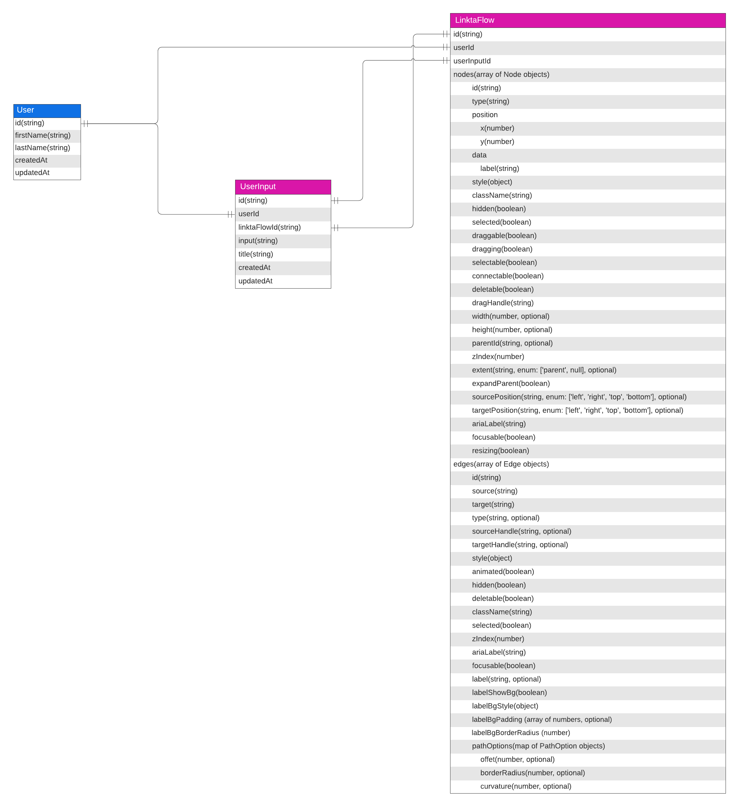

# API Design Documentation

## Introduction
This document provides an overview of the Linkta API, which follows a RESTful architecture and uses JSON for request and response payloads.

## Base URL
The base URL for the Linkta API is: `https://api.linkta.io`

## Diagram


## Endpoints
### User Authentication and Authorization
>_Work in progress_

#### Session Login
- **Endpoint:** `POST /v1/auth/login`
- **Description:** Authenticates a user using Firebase Authentication and generates a session token.
- **Payload:** `{ "idToken": "<Firebase ID Token>" }`
- **Responses:**
    - `200 OK`  : `{ "sessionToken": "<Newly Generated Session Token>" , "message": "Welcome, [name]! You are now logged in."}`
    - `400 Bad Request`  : `{ "message": "The login token provided is incorrect or expired. Please log in again to obtain a valid token." } `

#### Session Logout
- **Endpoint:** `POST /v1/auth/logout`
- **Description:** Invalidates the session token, effectively logging out the user.
- **Payload:** `{ "sessionToken": "<Session Token to Invalidate>" }`
- **Responses:**
    - `200 OK`  : `{ "message": "Logout successful." }`
    - `400 Bad Request`  : `{ "message": "Your session has expired. Please log in again to continue." } `

### UserInput Submission and Processing

#### Generate LinktaFlow from UserInput
- **Endpoint:** `POST /v1/inputs`
- **Description:** Receives a UserInput and begins processing it to generate a LinktaFlow.
- **Payload:** `{ "input": "User's Initial Input" }`
- **Headers:**
    - `Authorization: Bearer <session_token>`
    - `x-request-id: <unique request ID>`
- **Responses:**
    - `200 OK` : `{ "linktaFlow": <LinktaFlow Object> }`
    - `400 Bad Request` : `{ "message": "Your request could not be processed as it contains invalid data. Please check your input and try again." }`
    - `401 Unauthorized` : `{ "message": "You need to log in to access this resource. Please ensure you are logged in and try again." }`
    - `429 Too Many Requests` : `{ "message": "You have made too many requests in a short period. Please wait a while before trying again." }`
    - `500 Internal Server Error` : `{ "message": "A problem occurred on our server while processing your request. Our team has been notified, and we are working on a solution. Please try again later." }`

#### Fetch Input History
- **Endpoint:** `GET /v1/inputs`
- **Description:** Retrieves a list of UserInputs associated with a user.
- **Headers:**
    - `Authorization: Bearer <session_token>`
- **Responses:**
    - `200 OK` : `{ "inputHistory": [/*Array of userInput Objects*/] }`
    - `401 Unauthorized` : `{ "message": "You need to log in to access this resource. Please ensure you are logged in and try again." }`
    - `500 Internal Server Error` : `{ "message": "A problem occurred on our server while processing your request. Our team has been notified, and we are working on a solution. Please try again later." }`

#### Update UserInput Title
- **Endpoint:** `PUT /v1/inputs/:userInputId`
- **Description:** Add/update title of a specific user input(refelcting the 'Rename' feature on UI design).
- **Payload:** `{ "title": "Updated title" }`
- **Headers:**
    - `Authorization: Bearer <session_token>`
- **Responses:**
    - `200 OK` : `{ "message": "Input Title updated successfully on [timestamp] " }`
    - `401 Unauthorized` : `{ "message": "You need to log in to access this resource. Please ensure you are logged in and try again." }`
    - `429 Too Many Requests` : `{ "message": "You have made too many requests in a short period. Please wait a while before trying again." }`
    - `500 Internal Server Error` : `{ "message": "A problem occurred on our server while processing your request. Our team has been notified, and we are working on a solution. Please try again later." }`

#### Delete UserInput
- **Endpoint:** `DELETE /v1/inputs/:userInputId`
- **Description:** Deletes a specific userInput and its associated LinktaFlow.
- **Headers:**
    - `Authorization: Bearer <session_token>`
- **Responses:**
    - `200 OK` : `{ "message": "Input ID [userInputId] has been successfully deleted." }`
    - `401 Unauthorized` : `{ "message": "You need to log in to access this resource. Please ensure you are logged in and try again." }`
    - `500 Internal Server Error` : `{ "message": "A problem occurred on our server while processing your request. Our team has been notified, and we are working on a solution. Please try again later." }`

### LinktaFlow Management
>_Work in progress_

#### Fetch LinktaFlow
- **Endpoint:** `GET /v1/flows/:linktaFlowId `
- **Description:** Retrieves a specific LinktaFlow object based on the user input id.
- **Headers:**
    - `Authorization: Bearer <session_token>`
- **Responses:**
    - `200 OK`  :` { "linktaFlow": <LinktaFlow Object> }`
    - `401 Unauthorized`  : `{ "message": "You need to log in to access this resource. Please ensure you are logged in and try again." } `
    - `404 Not Found`  : `{ "message": "The requested Linkta Flow could not be found. It may have been deleted or the ID might be incorrect." } `
    - `500 Internal Server Error`  : `{ "message": "A problem occurred on our server while processing your request. Our team has been notified, and we are working on a solution. Please try again later." } `

#### Update LinktaFlow
- **Endpoint:** `PUT /v1/flows/:linktaFlowId`
- **Description:** Updates a specific LinktaFlow.
- **Payload:** `{ "updatedLinktaFlow": <Updated LinktaFlow Object> }  `
- **Headers:**
    - `Authorization: Bearer <session_token>`
- **Responses:**
    - `200 OK`  : `{ "message": "Linkta Flow updated successfully on [timestamp]." } `
    - `400 Bad Request`  :` { "message": "Your request could not be processed as it contains invalid data. Please check your input and try again." } `
    - `401 Unauthorized`  : `{ "message": "You need to log in to access this resource. Please ensure you are logged in and try again." } `
    - `404 Not Found  : { "message": "The requested Linkta Flow could not be found. It may have been deleted or the ID might be incorrect." }  `
    - `429 Too Many Requests` : `{ "message": "You have made too many requests in a short period. Please wait a while before trying again." }`
    - `500 Internal Server Error`  : `{ "message": "A problem occurred on our server while processing your request. Our team has been notified, and we are working on a solution. Please try again later." }`

#### Save LinktaFlow As A Copy
- **Endpoint:** `POST /v1/flows/save-as`
- **Description:** Creates new UserInput and LinktaFlow documents with the provided user input, custom title, and LinktaFlow object.
- **Payload:**
  ```json
  {
    "input": "User's New Input",
    "title": "Custom Title",
    "linktaFlow": {
      "nodes": [
        {
          "id": "node1",
          "type": "input",
          "data": {
            "label": "Start"
          }
        },
        ...
      ],
      "edges": [
        {
          "id": "edge1",
          "source": "node1",
          "target": "node2"
        },
        ...
      ]
    }
  }
  ```
- **Headers:**
    - `Authorization: Bearer <session_token>`
    - `x-request-id: <unique request ID>`
- **Responses:**
    - `201 Created` : `{ "message": "Your new input and Linkta Flow have been created successfully." }`
    - `400 Bad Request` : `{ "message": "Your request could not be processed as it contains invalid data. Please check your input and try again." }`
    - `401 Unauthorized` : `{ "message": "You need to log in to access this resource. Please ensure you are logged in and try again." }`
    - `429 Too Many Requests` : `{ "message": "You have made too many requests in a short period. Please wait a while before trying again." }`
    - `500 Internal Server Error` : `{ "message": "A problem occurred on our server while processing your request. Our team has been notified, and we are working on a solution. Please try again later." }`

### User Management and Settings
>_Work in progress_

#### Update User Settings
- **Endpoint:** `PUT /v1/users/settings`
- **Description:** Updates user settings.
- **Payload:** `{ "theme": "dark" }`
- **Headers:**
    - `Authorization: Bearer <session_token>`
- **Responses:**
    - `200 OK`  : `{ "message": "Your settings has been updated successfully." }`
    - `401 Unauthorized`  : `{ "message": "You need to log in to access this resource. Please ensure you are logged in and try again." } `
    - `403 Forbidden`  : `{ "message": "You do not have permission to perform this action. If you believe this is an error, please contact support." } `
    - `500 Internal Server Error`  : `{ "message": "A problem occurred on our server while processing your request. Our team has been notified, and we are working on a solution. Please try again later." } `

#### Delete User Account
- **Endpoint:** `DELETE /v1/users `
- **Description:** Deletes the user account.
- **Headers:**
    - `Authorization: Bearer <session_token>`
- **Responses:**
    - `200 OK`  :` { "message": "User account with ID [userId] has been successfully deleted." } `
    - `401 Unauthorized`  : `{ "message": "You need to log in to access this resource. Please ensure you are logged in and try again." } `
    - `403 Forbidden`  : `{ "message": "You do not have permission to perform this action. If you believe this is an error, please contact support." } `
    - `500 Internal Server Error`  : `{ "message": "A problem occurred on our server while processing your request. Our team has been notified, and we are working on a solution. Please try again later." } `

### Bug Reporting
>_Work in progress_

## Controllers, Middlewares and Services

### Controllers

#### UserInput Controller
- `generateLinktaFlowFromUserInput` : Receives a UserInput and begins processing it to generate a LinktaFlow.
- `fetchInputHistory` : Retrieves a list of UserInputs associated with a user.
- `updateUserInputTitle` : Updates the title of a specific UserInput.
- `deleteUserInput` : Deletes a specific UserInput and its associated LinktaFlow.

#### LinktaFlow Controller
- `fetchLinktaFlow` : Retrieves a specific LinktaFlow object based on the LinktaFlow's unique identifier.
- `updateLinktaFlow` : Updates a specific LinktaFlow.
- `saveLinktaFlowAsACopy`: Creates a new LinktaFlow object and UserInput based on the provided input, title, and LinktaFlow object.

#### User Account and Settings Controller
>  _Work in progress_
- `updateUserSettings` : Updates user settings.
- `deleteUserAccount` : Deletes the user account and associated data.

#### Bug Report Controller
>  _Work in progress_
- `submitBugReport` : Submits a new bug report.

### Services

#### Authentication Service
>  _Work in progress_
- `generateSessionToken` : Generates a custom session token for the client upon successful Firebase Authentication.
- `verifySessionToken` : Validates the session token for any subsequent requests that require authentication.
- `validateFirebaseToken` : Validates the Firebase ID Token using the Firebase Admin SDK.
- `invalidateSessionToken` : Clears the session token when the user logs out or when the token expires.

#### AI Service
- `startGeneration` : Generates a response with a prompt(userInput) and optional chat history.

#### UserInput Service
- `createUserInput` : Creates a new user input record in the database.
- `findUserInputsByUserId` : Retrieves a list of user inputs associated with a specific user ID.
- `updateUserInput` : Updates the title or other properties of a specific user input.
- `deleteUserInputAndAssociatedData` : Deletes a specific user input and its associated LinktaFlow data from the database.

#### LinktaFlow Service
>  _Work in progress_
- `createLinktaFlowFromInput` : Creates a new LinktaFlow record in the database based on the given UserInput.
- `createLinktaFlowFromObject` : Creates a new LinktaFlow record in the database based on the given LinktaFlow object.
- `findLinktaFlowById` : Retrieves a specific LinktaFlow object based on its unique identifier.
- `updateLinktaFlowById` : Updates the properties of a specific LinktaFlow.

#### User Account and Settings Service
>  _Work in progress_
- `createUser` : Creates a new user record in the database upon successful authentication, if the user doesn't already exist.
- `updateUserSettingsByUserId` : Updates the user's settings based on the provided payload.
- `deleteUserAndAssociatedData` : Deletes the user's account and associated data, including user inputs and LinktaFlows.

#### Bug Report Service
>  _Work in progress_
- `createBugReport` : Creates a new bug report record in the database, optionally associating it with a user ID if the user is authenticated.

### Middlewares

#### Authentication Middleware
>  _Work in progress_
- `login` : Authenticates a user using Firebase Authentication and generates a session token.
- `logout` : Invalidates the session token, effectively logging out the user.

#### AI Middleware
- `generateInitialResponse`: Handles generating initial response from AI.
- `generateResponseWithHistory`: Handles LLM response generation after the initial request and response cycle under the same userInput(**generateResponseWithHistory will be a stretch feature, as it provides context for LLM to continuosly generate enahnced responses under the same input)

#### Validation Middleware
- `validateUserInput` : Validates the user input to ensure it meets the required format and constraints.
- `validateLinktaFlow` : Validates the LinktaFlow data to ensure it meets the required format and constraints.

## Data Design
### Diagram


### Data Entities
>_Work in progress_

#### User
- id (string)
- firstName (string, required, minLength: 3, maxLength: 30, trimmed)
- lastName (string, required)
- createdAt (timestamp)
- updatedAt (timestamp)

#### UserInput
- id (string)
- userId (string, required, index:true, reference User)
- input (string, required)
- title (string, required)
- linktaFlowId (string)
- createdAt (timestamp)
- updatedAt (timestamp)

#### LinktaFlow
- id (string)
- userInputId (UserInput reference)
- userId (User reference)
- nodes (array of Node objects)
    - Node
        - id (string)
        - type (string)
        - position
            - x (number)
            - y (number)
        - data
            - label (string)
        - style (object)
        - className (string)
        - hidden (boolean)
        - selected (boolean)
        - draggable (boolean)
        - dragging (boolean)
        - selectable (boolean)
        - connectable (boolean)
        - deletable (boolean)
        - dragHandle (string)
        - width (number, optional)
        - height (number, optional)
        - parentId (string, optional)
        - zIndex (number)
        - extent (string, enum: ['parent', null], optional)
        - expandParent (boolean)
        - sourcePosition (string, enum: ['left', 'right', 'top', 'bottom'], optional)
        - targetPosition (string, enum: ['left', 'right', 'top', 'bottom'], optional)
        - ariaLabel (string)
        - focusable (boolean)
        - resizing (boolean)
- edges (array of Edge objects)
    - Edge
        - id (string)
        - source (string)
        - target (string)
        - type (string, optional)
        - sourceHandle (string, optional)
        - targetHandle (string, optional)
        - style (object)
        - animated (boolean)
        - hidden (boolean)
        - deletable (boolean)
        - className (string)
        - selected (boolean)
        - zIndex (number)
        - ariaLabel (string)
        - focusable (boolean)
        - label (string, optional)
        - labelStyle (object)
        - labelShowBg (boolean)
        - labelBgStyle (object)
        - labelBgPadding (array of numbers, optional)
        - labelBgBorderRadius (number)
        - pathOptions (map of PathOption objects)
            - PathOption
                - offset (number, optional)
                - borderRadius (number, optional)
                - curvature (number, optional)

#### Bug Report
>_Work in progress_

## Error Handling
> _Work in progress_

## Rate Limiting
> _Work in progress_

## Caching and Performance
> _Work in progress_

## Security
See [MVP System Design Documentation](MVP_SYSTEM_DESIGN_DOCUMENTATION.md)

## Testing
See [MVP System Design Documentation](MVP_SYSTEM_DESIGN_DOCUMENTATION.md)

## Deployment and DevOps
See [MVP System Design Documentation](MVP_SYSTEM_DESIGN_DOCUMENTATION.md)

## API Versioning and Lifecycle
**Versioning Strategy**
Linkta API adheres to semantic versioning (SemVer). Major versions (`**v1**`, `**v2**`, etc.) indicate potential backward-incompatible changes, while minor and patch updates (`**v1.1**`, `**v1.2**`, `**v1.2.1**`, etc.) introduce backward-compatible improvements and bug fixes.