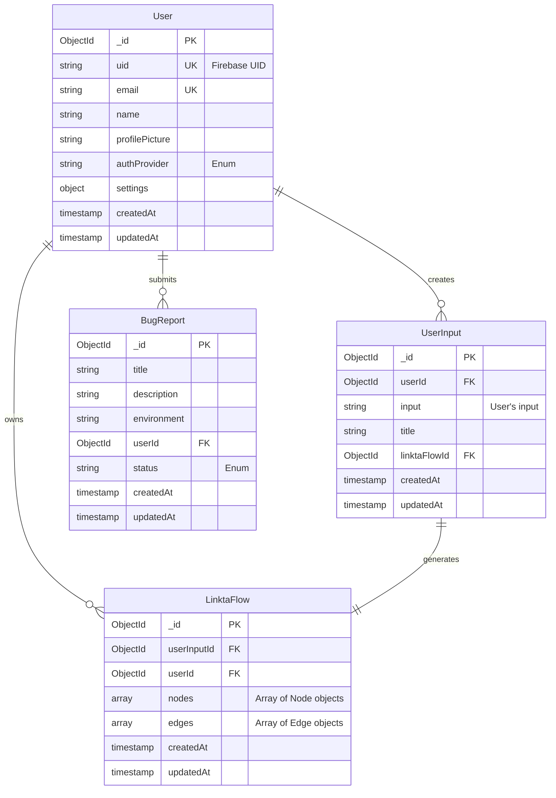

# API Design Documentation

## Introduction
This document provides an overview of the Linkta API, which follows a RESTful architecture and uses JSON for request and response payloads.

## Base URL
The base URL for the Linkta API is: `https://api.linkta.io`

## Diagram


## Endpoints
### UserInput Submission and Processing

#### Generate LinktaFlow from UserInput
- **Endpoint:** `POST /v1/inputs`
- **Description:** Receives a UserInput and begins processing it to generate a LinktaFlow.
- **Payload:** `{ "input": "User's Input" }`
- **Headers:**
    - `Authorization: idToken: <Firebase ID Token>`
    - `x-request-id: <unique request ID>`
- **Responses:**
    - `201 Created` : `{ "message": "LinktaFlow id <linktaFlowId> created successfully", "userInputId": <userInputId>}`
    - `400 Bad Request` : `{ "message": "Your request could not be processed as it contains invalid data. Please check your input and try again." }`
    - `401 Unauthorized` : `{ "message": "You need to log in to access this resource. Please ensure you are logged in and try again." }`
    - `403 Forbidden` : `{ "message": "You don't have permission to perform this action." }`
    - `429 Too Many Requests` : `{ "message": "You have made too many requests in a short period. Please wait a while before trying again." }`
    - `500 Internal Server Error` : `{ "message": "A problem occurred on our server while processing your request. Our team has been notified, and we are working on a solution. Please try again later." }`
    - `503 Service Unavailable` : `{ "message": "The service is temporarily unavailable. Please try again later." }`

#### Fetch Input History
- **Endpoint:** `GET /v1/inputs`
- **Description:** Retrieves a list of UserInputs associated with a user.
- **Headers:**
    - `Authorization: idToken: <Firebase ID Token>`
- **Responses:**
    - `200 OK` : `{ "inputHistory": [/*Array of userInput Objects*/] }`
    - `400 Bad Request` : `{ "message": "Invalid request parameters." }`
    - `401 Unauthorized` : `{ "message": "You need to log in to access this resource. Please ensure you are logged in and try again." }`
    - `403 Forbidden` : `{ "message": "You don't have permission to access this resource." }`
    - `500 Internal Server Error` : `{ "message": "A problem occurred on our server while processing your request. Our team has been notified, and we are working on a solution. Please try again later." }`
    - `503 Service Unavailable` : `{ "message": "The service is temporarily unavailable. Please try again later." }`

#### Update UserInput Title
- **Endpoint:** `PUT /v1/inputs/:userInputId`
- **Description:** Add/update title of a specific user input (reflecting the 'Rename' feature on UI design).
- **Payload:** `{ "title": "Updated title" }`
- **Headers:**
    - `Authorization: idToken: <Firebase ID Token>`
- **Responses:**
    - `200 OK` : `{ "message": "Input Title updated successfully.", "inputHistory": [/*Array of userInput Objects*/] }`
    - `400 Bad Request` : `{ "message": "Invalid input. Please provide a valid title." }`
    - `401 Unauthorized` : `{ "message": "You need to log in to access this resource. Please ensure you are logged in and try again." }`
    - `403 Forbidden` : `{ "message": "You don't have permission to update this input." }`
    - `404 Not Found` : `{ "message": "The specified user input could not be found." }`
    - `429 Too Many Requests` : `{ "message": "You have made too many requests in a short period. Please wait a while before trying again." }`
    - `500 Internal Server Error` : `{ "message": "A problem occurred on our server while processing your request. Our team has been notified, and we are working on a solution. Please try again later." }`
    - `503 Service Unavailable` : `{ "message": "The service is temporarily unavailable. Please try again later." }`

#### Delete UserInput
- **Endpoint:** `DELETE /v1/inputs/:userInputId`
- **Description:** Deletes a specific userInput and its associated LinktaFlow.
- **Headers:**
    - `Authorization: idToken: <Firebase ID Token>`
- **Responses:**
    - `200 OK` : `{ "message": "Input has been successfully deleted.", "inputHistory": [/*Array of userInput Objects*/] }`
    - `400 Bad Request` : `{ "message": "Invalid request parameters." }`
    - `401 Unauthorized` : `{ "message": "You need to log in to access this resource. Please ensure you are logged in and try again." }`
    - `403 Forbidden` : `{ "message": "You don't have permission to delete this input." }`
    - `404 Not Found` : `{ "message": "The specified user input could not be found." }`
    - `500 Internal Server Error` : `{ "message": "A problem occurred on our server while processing your request. Our team has been notified, and we are working on a solution. Please try again later." }`
    - `503 Service Unavailable` : `{ "message": "The service is temporarily unavailable. Please try again later." }`

### LinktaFlow Management

#### Fetch LinktaFlow
- **Endpoint:** `GET /v1/flows/:userInputId `
- **Description:** Retrieves a specific LinktaFlow object based on the user input id.
- **Headers:**
    - `Authorization: idToken: <Firebase ID Token>`
- **Responses:**
    - `200 OK`  :
    ```json
    {
    "linktaFlow": {
        "id": "unique linktaflow identifier",
        "userInputId": "unique user input identifier",
        "nodes": [
        {
            "id": "unique node identifier",
            "type": "node type",
            "position": {
            "x": "position x",
            "y": "position y"
            },
            "data": {
            "label": "node label"
            }
        }
        // More nodes...
        ],
        "edges": [
        {
            "id": "unique edge identifier",
            "source": "source node identifier",
            "target": "target node identifier"
        }
        // More edges...
        ]
    }
    }
    ```
    - `400 Bad Request` : `{ "message": "Invalid request parameters." }`
    - `401 Unauthorized` : `{ "message": "You need to log in to access this resource. Please ensure you are logged in and try again." }`
    - `403 Forbidden` : `{ "message": "You don't have permission to access this LinktaFlow." }`
    - `404 Not Found` : `{ "message": "The requested Linkta Flow could not be found. It may have been deleted or the ID might be incorrect." }`
    - `500 Internal Server Error` : `{ "message": "A problem occurred on our server while processing your request. Our team has been notified, and we are working on a solution. Please try again later." }`
    - `503 Service Unavailable` : `{ "message": "The service is temporarily unavailable. Please try again later." }`

#### Update LinktaFlow
- **Endpoint:** `PUT /v1/flows/:linktaFlowId`
- **Description:** Updates a specific LinktaFlow.
- **Payload:**
    ```json
    {
    "updatedLinktaFlow": {
        "nodes": [
        {
            "id": "unique node identifier",
            "type": "node type",
            "position": {
            "x": "position x",
            "y": "position y"
            },
            "data": {
            "label": "node label"
            }
        }
        // More nodes...
        ],
        "edges": [
        {
            "id": "unique edge identifier",
            "source": "source node identifier",
            "target": "target node identifier"
        }
        // More edges...
        ]
    }
    }
    ```
- **Headers:**
    - `Authorization: idToken: <Firebase ID Token>`
- **Responses:**
    - `200 OK` : `{ "message": "Linkta Flow updated successfully." }`
    - `400 Bad Request` : `{ "message": "Your request could not be processed as it contains invalid data. Please check your input and try again." }`
    - `401 Unauthorized` : `{ "message": "You need to log in to access this resource. Please ensure you are logged in and try again." }`
    - `403 Forbidden` : `{ "message": "You don't have permission to update this LinktaFlow." }`
    - `404 Not Found` : `{ "message": "The requested Linkta Flow could not be found." }`
    - `429 Too Many Requests` : `{ "message": "You have made too many requests in a short period. Please wait a while before trying again." }`
    - `500 Internal Server Error` : `{ "message": "A problem occurred on our server while processing your request. Our team has been notified, and we are working on a solution. Please try again later." }`
    - `503 Service Unavailable` : `{ "message": "The service is temporarily unavailable. Please try again later." }`

#### Save LinktaFlow As A Copy
>  _Work in progress_
- **Endpoint:** `POST /v1/flows/save-as`
- **Description:** Creates new UserInput and LinktaFlow documents with the provided user input, custom title, and LinktaFlow object.
- **Payload:**
    ```json
    {
    "newLinktaFlow": {
        "input": "new input",
        "title": "new title",
        "nodes": [
        {
            "id": "unique node identifier",
            "type": "node type",
            "position": {
            "x": "position x",
            "y": "position y"
            },
            "data": {
            "label": "node label"
            }
        }
        // More nodes...
        ],
        "edges": [
        {
            "id": "unique edge identifier",
            "source": "source node identifier",
            "target": "target node identifier"
        }
        // More edges...
        ]
    }
    }
    ```
- **Headers:**
    - `Authorization: idToken: <Firebase ID Token>`
    - `x-request-id: <unique request ID>`
- **Responses:**
    - `201 Created` : `{ "message": "Your new input and Linkta Flow have been created successfully." }`
    - `400 Bad Request` : `{ "message": "Your request could not be processed as it contains invalid data. Please check your input and try again." }`
    - `401 Unauthorized` : `{ "message": "You need to log in to access this resource. Please ensure you are logged in and try again." }`
    - `403 Forbidden` : `{ "message": "You don't have permission to perform this action." }`
    - `429 Too Many Requests` : `{ "message": "You have made too many requests in a short period. Please wait a while before trying again." }`
    - `500 Internal Server Error` : `{ "message": "A problem occurred on our server while processing your request. Our team has been notified, and we are working on a solution. Please try again later." }`
    - `503 Service Unavailable` : `{ "message": "The service is temporarily unavailable. Please try again later." }`

### User Management and Settings

#### Create User Profile
- **Endpoint:** `POST /v1/users`
- **Description:** Generates a new user profile.
- **Payload:** `{ "name": "User's Name" }`
- **Headers:**
    - `Authorization: idToken: <Firebase ID Token>`
- **Responses:**
    - `201 Created` : `{ "newUserProfile": { "email": "user@example.com", "name": "User's Name", "profilePicture": "url", "settings": {} } }`
    - `400 Bad Request` : `{ "message": "Invalid input. Please ensure the name is provided and is between 2 and 50 characters long." }`
    - `401 Unauthorized` : `{ "message": "You need to log in to access this resource. Please ensure you are logged in and try again." }`
    - `409 Conflict` : `{ "message": "A user profile already exists for this account." }`
    - `500 Internal Server Error` : `{ "message": "A problem occurred on our server while processing your request. Our team has been notified, and we are working on a solution. Please try again later." }`
    - `503 Service Unavailable` : `{ "message": "The service is temporarily unavailable. Please try again later." }`

#### Fetch User Profile
- **Endpoint:** `GET /v1/users`
- **Description:** Fetches the user profile.
- **Headers:**
    - `Authorization: idToken: <Firebase ID Token>`
- **Responses:**
    - `200 OK` : `{ "userProfile": { "email": "user@example.com", "name": "User's Name", "profilePicture": "url", "settings": {} } }`
    - `401 Unauthorized` : `{ "message": "You need to log in to access this resource. Please ensure you are logged in and try again." }`
    - `404 Not Found` : `{ "message": "User profile not found. Please create a profile first." }`
    - `500 Internal Server Error` : `{ "message": "A problem occurred on our server while processing your request. Our team has been notified, and we are working on a solution. Please try again later." }`
    - `503 Service Unavailable` : `{ "message": "The service is temporarily unavailable. Please try again later." }`

#### Update User Settings
>  _Work in progress_
- **Endpoint:** `PUT /v1/users`
- **Description:** Updates user settings. At least one of updatedName, updatedEmail, or updatedSettings must be provided.
- **Payload:**
    ```json
    {
    "updatedName": "updated user name",
    "updatedEmail": "updated user email",
    "updatedSettings": {
        "theme": "dark"
    }
    }
    ```
- **Headers:**
    - `Authorization: idToken: <Firebase ID Token>`
- **Responses:**
    - `200 OK` : `{ "message": "Your settings have been updated successfully." }`
    - `400 Bad Request` : `{ "message": "Invalid input. Please provide at least one valid field to update (name, email, or settings)." }`
    - `401 Unauthorized` : `{ "message": "You need to log in to access this resource. Please ensure you are logged in and try again." }`
    - `403 Forbidden` : `{ "message": "You don't have permission to update this user profile." }`
    - `404 Not Found` : `{ "message": "User profile not found. Please create a profile first." }`
    - `409 Conflict` : `{ "message": "The provided email is already associated with another account." }`
    - `422 Unprocessable Entity` : `{ "message": "The provided data is invalid. Please check the format of your input." }`
    - `500 Internal Server Error` : `{ "message": "A problem occurred on our server while processing your request. Our team has been notified, and we are working on a solution. Please try again later." }`
    - `503 Service Unavailable` : `{ "message": "The service is temporarily unavailable. Please try again later." }`

### Bug Reporting
>_Work in progress_
#### Submit Bug Report
- **Endpoint:** `POST /v1/bug-reports`
- **Description:** Submit a new bug report. This can be done by both authenticated and unauthenticated users.
- **Payload:**
    ```json
    {
    "title": "Brief bug description",
    "description": "Detailed bug explanation",
    "environment": "Browser/OS info"
    }
    ```
- **Headers:**
    - `Authorization: <Firebase ID Token>`
- **Responses:**
    - `201 Created` : `{ "message": "Bug report submitted successfully", "reportId": "unique_report_id" }`
    - `400 Bad Request` : `{ "message": "Invalid input. Please check your data and try again." }`
    - `401 Unauthorized` : `{ "message": "You need to log in to access this resource. Please ensure you are logged in and try again." }`
    - `429 Too Many Requests` : `{ "message": "You have submitted too many bug reports recently. Please try again later." }`
    - `500 Internal Server Error` : `{ "message": "A problem occurred on our server while processing your request. Our team has been notified, and we are working on a solution. Please try again later." }`
    - `503 Service Unavailable` : `{ "message": "The service is temporarily unavailable. Please try again later." }`

## Controllers, Middlewares and Services

### Controllers

#### UserInput Controller
- `generateLinktaFlowFromUserInput` : Receives a UserInput and begins processing it to generate a LinktaFlow.
- `fetchInputHistory` : Retrieves a list of UserInputs associated with a user.
- `updateInputTitle` : Updates the title of a specific UserInput.
- `deleteUserInput` : Deletes a specific UserInput and its associated LinktaFlow.

#### LinktaFlow Controller
- `fetchLinktaFlow` : Retrieves a specific LinktaFlow object based on the LinktaFlow's unique identifier.
- `updateLinktaFlow` : Updates a specific LinktaFlow.
- `saveLinktaFlowAsACopy`:
>  _Work in progress_
Creates a new LinktaFlow object and UserInput based on the provided input, title, and LinktaFlow object.

#### User Account and Settings Controller
- `createUserProfile` : Generates a new user profile based on the provided user data.
- `fetchUserProfile` : Retrieves the user profile for the authenticated user.
- `updateUserSettings` :
>  _Work in progress_
Updates user settings including name, email, and other preferences.

#### Bug Report Controller
>  _Work in progress_
- `submitBugReport` : Submits a new bug report.

### Services

#### AI Service
- `generateInitialResponse` : Handles generating initial response from AI.

#### UserInput Service
- `createUserInput` : Creates a new user input record in the database.
- `findUserInputsByUserId` : Retrieves a list of user inputs associated with a specific user ID.
- `updateInputTitle` : Updates the title of a specific user input.
- `deleteUserInputAndAssociatedData` : Deletes a specific user input and its associated LinktaFlow data from the database.

#### LinktaFlow Service
- `createLinktaFlow` : Creates a new LinktaFlow record in the database based on the given LinktaFlow object.
- `fetchLinktaFlowByUserInputId` : Retrieves a specific LinktaFlow object based on a UserInputId.
- `updateLinktaFlowById` : Updates the properties of a specific LinktaFlow.
- `deleteLinktaFlowByUserInputId`: Delete a LinktaFlow based on a UserInputId

#### User Account and Settings Service
- `findUserByUid` : Finds a user in the database by their Firebase UID.
- `findUserById` : Finds a user in the database by their MongoDB ObjectId.
- `createUserProfileById` : Creates a new user record in the database with the provided user data.
- `updateUserProfile` : Updates the user's settings in the database based on the provided payload, which may include name, email, and other settings.

#### Bug Report Service
- `createBugReport` : Creates a new bug report record in the database, optionally associating it with a user ID if the user is authenticated.

#### Idempotency Service
- `findIdempotencyRecord`: Finds an idempotency record by key in the database.
- `createIdempotencyRecord`: Creates a new idempotency record in the database with the given key and response.

### Middlewares

#### Firebase Authentication Middleware
- `isAuthorized` : Verifies Firebase ID token, finds or prepares user data, and attaches it to the request. It handles token validation, user lookup, and sets up data for potential new user creation.

#### Validation Middleware
- The validation middleware function validates different parts of an incoming request (body, query, params, headers) using Zod schemas. If the validation fails, it responds with a 400 Bad Request status and an appropriate error message.

#### Rate Limiting Middleware
- `RateLimiter` : Limits requests to 60 per IP address every 15 minutes. Uses draft-7 standard headers for rate limit information. Logs rate limit hits server-side and returns a custom error message ("Rate limit reached. You have sent too many requests!") when the limit is exceeded.

#### Error Handling Middleware
- `globalErrorHandler`  : Processes all errors uniformly, providing consistent error responses. It handles both custom and standard errors, logs error details, and returns a standardized JSON response with appropriate HTTP status codes and user-friendly error messages.

#### Idempotency Middleware
- `createIdempotencyMiddleware`: Creates a middleware that ensures idempotent behavior for API requests. It checks for an existing idempotency record, and if found, returns the stored response. Otherwise, it sets up the necessary context for creating a new idempotency record after the request is processed.

## Data Design
### ER Diagram


### Data Entities

#### User
- _id (ObjectId, auto-generated)
- uid (string, required, unique, indexed)
- email (string, unique)
- name (string)
- profilePicture (string)
- authProvider (string, enum: ['password', 'google.com', 'github.com'], required)
- settings (object)
    - theme (string, enum: ['light', 'dark'], default: 'light')
- createdAt (timestamp)
- updatedAt (timestamp)

#### UserInput
- _id (ObjectId, auto-generated)
- userId (ObjectId, required, indexed, reference to User)
- input (string, required)
- title (string, required)
- linktaFlowId (ObjectId, reference to LinktaFlow)
- createdAt (timestamp)
- updatedAt (timestamp)

#### LinktaFlow
>_Work in progress_
- _id (ObjectId, auto-generated)
- userInputId (ObjectId, required, reference to UserInput)
- userId (ObjectId, required, reference to User)
- nodes (array of Node objects)
  - id (string, required)
  - data (object)
     - label (string, required)
- edges (array of Edge objects)
  - id (string, required)
  - source (string, required)
  - target (string, required)
- createdAt (timestamp)
- updatedAt (timestamp)

#### Bug Report
>_Work in progress_
- _id (ObjectId, auto-generated)
- title (string, required)
- description (string, required)
- environment (string)
- userId (ObjectId, reference to User)
- status (string, enum: ['new', 'in-progress', 'resolved', 'closed'], default: 'new')
- createdAt (timestamp)
- updatedAt (timestamp)

## Error Handling
See [MVP System Design Documentation](MVP_SYSTEM_DESIGN_DOCUMENTATION.md)

## Rate Limiting

### Purpose:
To ensure fair usage and protect the API from abuse by limiting the number of requests a user can make within a specified time frame.

### Configuration:
- **Requests per window:** 60
- **Window duration:** 15 minutes
- **Headers:** Uses `draft-7` standard for rate limit information.
- **Message:** "Rate limit reached. You have sent too many requests!"
- **Logging:** Logs rate limit hits server-side.

### Implementation:
Rate limiting middleware is applied to all API routes. When the limit is exceeded, a `429 Too Many Requests` response is returned with a custom message.

## Caching and Performance
> _Work in progress_

## Security
See [MVP System Design Documentation](MVP_SYSTEM_DESIGN_DOCUMENTATION.md)

## Testing
See [MVP System Design Documentation](MVP_SYSTEM_DESIGN_DOCUMENTATION.md)

## Deployment and DevOps
See [MVP System Design Documentation](MVP_SYSTEM_DESIGN_DOCUMENTATION.md)

## API Versioning and Lifecycle
**Versioning Strategy**
Linkta API adheres to semantic versioning (SemVer). Major versions (`**v1**`, `**v2**`, etc.) indicate potential backward-incompatible changes, while minor and patch updates (`**v1.1**`, `**v1.2**`, `**v1.2.1**`, etc.) introduce backward-compatible improvement and bug fixes.
