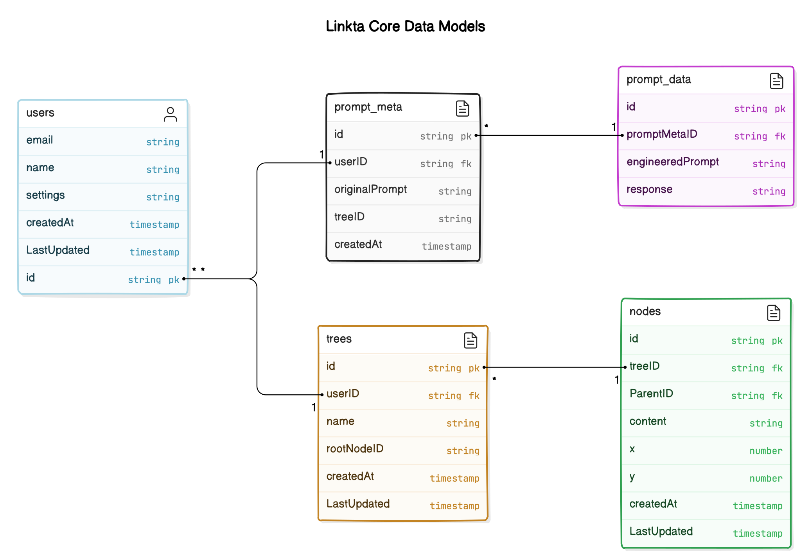

# API Design Documentation

## Introduction
This document provides an overview of the Linkta API, which follows a RESTful architecture and uses JSON for request and response payloads.

## Base URL
The base URL for the Linkta API is: `https://api.linkta.io/v1`

## Diagram

## Endpoints

### Authentication
#### Session Login
- **Endpoint:** `POST /api/auth/session-login`
- **Description:** Authenticates a user using Firebase Authentication and generates a session token.
- **Payload:** `{ "idToken": "" }`
- **Responses:**
    - `200 OK` : `{ "sessionToken": "" }`
    - `400 Bad Request` : `{ "message": "Invalid ID token" }`
#### Session Logout
- **Endpoint:** `POST /api/auth/session-logout`
- **Description:** Invalidates the session token, effectively logging out the user.
- **Payload:** `{ "sessionToken": "" }`
- **Responses:**
    - `200 OK` : `{ "message": "Logout successful" }`
    - `400 Bad Request` : `{ "message": "Invalid session token" }`

### Prompt Submission and Augmentation
#### Submit Prompt
- **Endpoint:** `POST /api/prompts`
- **Description:** Receives a user's prompt, processes it, sends it to the LLM, and returns the generated tree structure.
- **Payload:** `{ "prompt": "User's initial prompt" }`
- **Headers:**
    - `Authorization: Bearer <session_token>`
- **Responses:**
    - `201 Created` : `{ "tree": { "id": "treeId", "nodes": [/* array of nodes */] } }`
    - `400 Bad Request` : `{ "message": "Invalid request payload" }`
    - `401 Unauthorized` : `{ "message": "User not authenticated" }`
    - `429 Too Many Requests` : `{ "message": "Rate limit exceeded" }`
    - `500 Internal Server Error` : `{ "message": "Error in processing prompt or generating tree" }`

### Tree Management
#### Fetch Tree List
- **Endpoint:** `GET /api/trees`
- **Description:** Retrieves all trees (names only) associated with the authenticated user after user login.
- **Headers:**
    - `Authorization: Bearer <session_token>`
- **Responses:**
    - `200 OK` : `{ "trees": [{ "id": "treeId", "name": "Tree Name" }] }`
    - `401 Unauthorized` : `{ "message": "User not authenticated" }`
    - `500 Internal Server Error` : `{ "message": "Error in retrieving trees" }`

#### Fetch Specific Tree
- **Endpoint:** `GET /api/trees/{treeId}`
- **Description:** Retrieves a specific tree and all its associated nodes based on the tree's unique identifier.
- **Headers:**
    - `Authorization: Bearer <session_token>`
- **Responses:**
    - `200 OK` : `{ "tree": { "id": "treeId", "nodes": [/* array of nodes */] } }`
    - `401 Unauthorized` : `{ "message": "User not authenticated" }`
    - `404 Not Found` : `{ "message": "Tree not found" }`
    - `500 Internal Server Error` : `{ "message": "Error in retrieving tree" }`

#### Update Tree
- **Endpoint:** `PUT /api/trees/{treeId}`
- **Description:** Updates the state of a specific tree.
- **Headers:**
    - `Authorization: Bearer <session_token>`
- **Responses:**
    - `200 OK` : `{ "message": "Tree last updated at X time" }`
    - `400 Bad Request` : `{ "message": "Invalid request payload" }`
    - `401 Unauthorized` : `{ "message": "User not authenticated" }`
    - `404 Not Found` : `{ "message": "Tree not found" }`
    - `500 Internal Server Error` : `{ "message": "Error in updating tree state" }`

#### Delete Tree
- **Endpoint:** `DELETE /api/trees/{treeId}`
- **Description:** Deletes a specific tree and all its associated nodes.
- **Headers:**
    - `Authorization: Bearer <session_token>`
- **Responses:**
    - `200 OK` : `{ "message": "Tree deleted successfully" }`
    - `401 Unauthorized` : `{ "message": "User not authenticated" }`
    - `403 Forbidden` : `{ "message": "User not authorized to delete this tree" }`
    - `404 Not Found` : `{ "message": "Tree not found" }`
    - `500 Internal Server Error` : `{ "message": "Error in deleting tree" }`

### User Management
#### Update User Settings
- **Endpoint:** `PUT /api/users/settings`
- **Description:** Updates user settings.
- **Payload:** `{ "theme": "dark" }`
- **Headers:**
    - `Authorization: Bearer <session_token>`
- **Responses:**
    - `200 OK` : `{ "message": "User settings updated" }`
    - `401 Unauthorized` : `{ "message": "User not authenticated" }`

#### Delete User Account
- **Endpoint:** `DELETE /api/users`
- **Description:** Deletes the user account.
- **Headers:**
    - `Authorization: Bearer <session_token>`
- **Responses:**
    - `200 OK` : `{ "message": "User account deleted successfully" }`
    - `401 Unauthorized` : `{ "message": "User not authenticated" }`
    - `403 Forbidden` : `{ "message": "Cannot delete user account" }`
    - `500 Internal Server Error` : `{ "message": "Error in deleting user account" }`

## Data Models

**Current Data models:**

**User Model**
- **ID** (String, required, unique): A unique identifier typically used to store Firebase ID.
- **TreeIDs** (Array of String references): A list of references to Tree objects.

**Tree Node Model**
- **ID** (String, required): A unique identifier for each node.
- **Content** (String, required): The content or information contained within the node.
- **ChildNodes** (Array of String references): References to child Node objects, forming a hierarchical (tree-like) structure.
- **Depth** (Integer, required, default: 0): The depth level of the node within the tree, where 0 typically represents the root level.

**Proposed Data models (work in progress):**

### User Model
- **ID** (String, unique, required): Unique identifier for the user, typically the Firebase UID.
- **Email** (String, unique, required): User's email address.
- **Name** (String, required): The name of the user.
- **Settings**:
    - **Theme** (String, default: 'light'): The theme setting for the user's interface.
- **CreatedAt** (DateTime, required): Timestamp when the user account was created.
- **LastUpdated** (DateTime, required): Timestamp when the user settings were last updated.

### Prompt Meta Model
- **ID** (String, unique, required): Unique identifier for the prompt metadata.
- **UserID** (String, required, Index, true): Reference to the User ID.
- **OriginalPrompt** (String, required): The original text of the user's prompt.
- **TreeID** (String, required): Reference to the tree to which the prompt belongs.
- **CreatedAt** (DateTime, required): Timestamp when the prompt metadata was created.

### Prompt Data Model
- **ID** (String, unique, required): Unique identifier for the prompt data.
- **PromptMetaID** (String, required): Reference to the Prompt Meta ID.
- **EngineeredPrompt** (String): The prompt after processing and optimization.
- **Response** (Object): The raw response from the language model processing the engineered prompt.

### Tree Model
- **ID** (String, unique, required): Unique identifier for the tree.
- **UserID** (String, required, Index, true): Reference to the user who owns the tree.
- **Name** (String, required): Descriptive name of the tree.
- **RootNodeID** (String, required, Index, true): Reference to the root node of this tree.
- **CreatedAt** (DateTime, required): Timestamp when the tree was created.
- **LastUpdated** (DateTime, required): Timestamp when the tree was last updated.

### Node Model
- **ID** (String, required): Unique identifier for the node.
- **TreeID** (String, required): Reference to the tree to which the node belongs.
- **ParentID** (String, optional): Direct reference to the parent node.
- **Content** (String, required): Information or data contained within the node.
- **Position**:
    - **X** (Number, required): X-coordinate for visual positioning in frontend.
    - **Y** (Number, required): Y-coordinate for visual positioning in frontend.
- **CreatedAt** (DateTime, required): Timestamp when the node was created.
- **LastUpdated** (DateTime): Timestamp when the node was last updated.

## Services

### User Authentication and Authorization

#### Authentication
Initial request:
- **Firebase Token Validation:** Validates Firebase ID Token using Firebase Admin SDK
- **Session Token Generation:** If Firebase Authentication is successful, generate a custom session token for the client

Subsequent requests:
- **Session Token Validation:** Validates the session token for any subsequent requests that require authentication

**Session Termination:**
- **Token Invalidation:** Removes the session token as inactive

### Prompt Submission and Augmentation

**Prompt Processing:**
- Validates and cleans the user's submitted prompt according to a predefined schema.
- Stores the prompt in the database.

**Prompt Engineering:**
- Takes the sanitized prompt, adds the relevant context, and transforms it into a format optimized for processing by an LLM.
- Stores the engineered prompt in the database.

**Async LLM Interaction:**
- **Background Processing:** Processes the prompt in a background job queue. Upon submitting a prompt, the user receives a task ID, which they can use to poll the status of the processing. This approach allows the user interface to remain responsive and provides the user with real-time updates on the processing status.
- **LLM Request Handling:** Sends the engineered prompt to the LLM. It then waits for a response. If a response is not received within a set timeout period, it triggers a retry mechanism.
- **Retry Mechanism:** If the LLM does not respond within the expected time, the middleware retries the request up to a predefined number of times.
- **Response Validation:** Post-processes the LLM's response and stores the response in the database.

### Tree Visualization and Operations
Work in progress.

### User Management

**Update User Settings:**
- Updates the user's settings in the database based on the provided payload

**Delete User Account:**
- Removes the user's record from the database, along with any related data such as user settings, trees, nodes, and prompt history.

## Error Handling
Work in progress.

## Rate Limiting
Work in progress.

## Caching and Performance
Work in progress.

## Security
Work in progress.

## Testing
Work in progress.

## Deployment and DevOps
Work in progress.

## API Versioning and Lifecycle
Work in progress.
