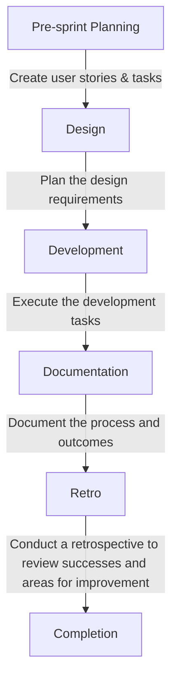

### Sprint Planning:
**Strategy:** Module by Module

### Sprint Order (see `Module Design` under [MVP System Design Doc](./MVP_SYSTEM_DESIGN_DOCUMENTATION.md)):
1. UserInput Submission and Processing
2. LinktaFlow Visualization and Interaction
3. User Authentication and Authorization
4. User Management and Settings
5. Bug Reporting
6. Cross-Cutting Concerns
7. Testing (non-module)
8. Styling (non-module)
9. Infrastructure and DevOps

### How user stories and tickets are made for each sprint:
1. Open [MVP System Design Doc](./MVP_SYSTEM_DESIGN_DOCUMENTATION.md) -> scroll down to `Module Design`.
2. Identify the next sprint by sprint number.
3. Add design (UI, API, frontend, data models) tasks.
4. Go through the tasks under the module to confirm all issues are addressed.
5. Feed tasks to AI to generate acceptance criteria (optional), check and confirm all the acceptance criteria are logical.
7. Create user stories and tasks:
    1. Open the project (Linkta Core MVP): https://github.com/orgs/Linkta-org/projects/6
    2. Instruction on how to create a user story and ticket: https://www.youtube.com/watch?v=-MBEnpAgmug&t=25s
    3. Create a user story under ‘Current Sprint’, add the tag ‘user story’.
    4. Create tasks under ‘To Do’ with the task template, add the tag ‘task’, and other related tags such as design, frontend, backend, etc.
    5. Add estimation (in hour)